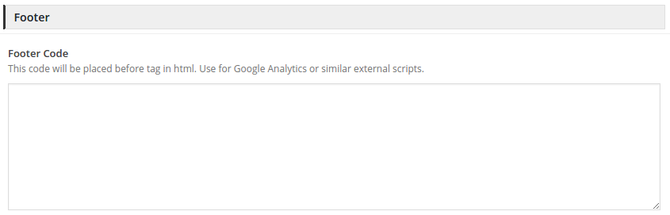

# ACF Divider Field

An divider field that lets you group multiple fields under an divider.

### Compatibility

This ACF field type is compatible with:
* ACF 5

### Installation

1. Copy the `acf-field-divider` folder into your `wp-content/plugins` folder
2. Activate the Divider plugin via the plugins admin page
3. Create a new field via ACF and select the Divider type
4. Please refer to the description for more info regarding the field type settings
